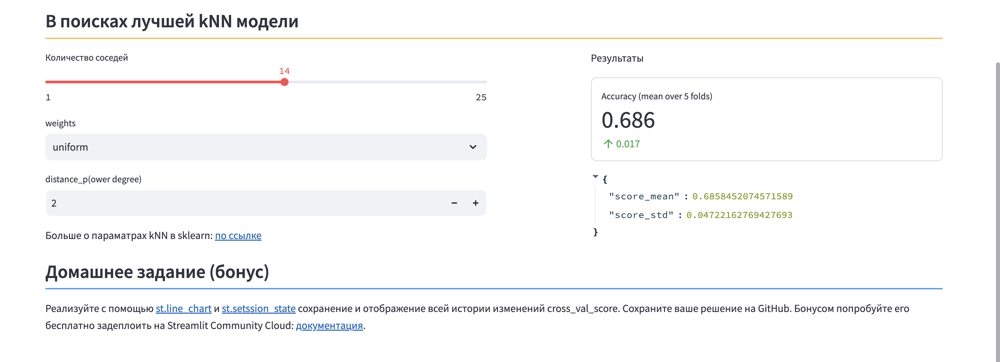

# Задание на Streamlit

По адресу https://bdt-knn-demo.streamlit.app/ доступно следующее приложение:

Скопируйте себе это приложение (fork) и реализуйте с помощью [st.line_chart](https://docs.streamlit.io/develop/api-reference/charts/st.line_chart)
и [st.setssion_state](https://docs.streamlit.io/develop/api-reference/caching-and-state/st.session_state)
сохранение и отображение всей истории изменений cross_val_score. Сохраните ваше решение на GitHub. Бонусом
попробуйте его бесплатно задеплоить на Streamlit Community Cloud:
[документация](https://docs.streamlit.io/deploy/streamlit-community-cloud/get-started).
